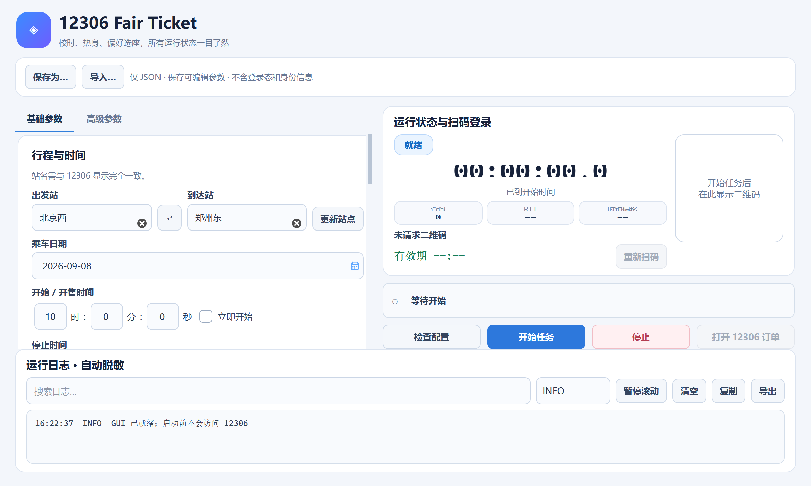
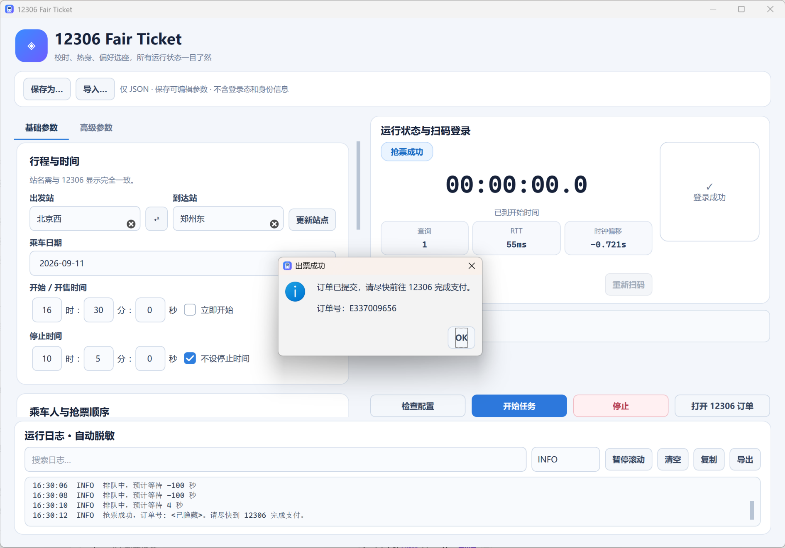

# 🚄 12306 Fair Ticket

一个带图形界面的 12306 抢票辅助工具。

它会自动对准 12306 服务器时间，提前做好登录、乘车人和车次准备，在开售前进入高频查询；发现符合条件的票后，可以直接帮你提交订单。

**你只需要填好行程、扫码登录，然后等结果。**

> ⚠️ 本项目无出票和支付功能。提交成功后需前往 12306 App 或官网完成支付。

## ✨ 主要功能

- ⚡ **瞄准开售瞬间**：自动校准 12306 服务器时间，开售前提前热身查询，减少本地时间不准和临时准备带来的影响。
- 🎯 **座位和铺位都能选**：支持靠窗、过道、相对前后排，以及上铺、中铺、下铺数量偏好。
- 🖥️ **一个界面完成全部设置**：车站、日期、时间、乘车人、车次、席别和查询频率都可以直接调整。
- 🚆 **按你的顺序抢**：车次和席别可以设置优先级，席别支持直接拖动排序。
- ✅ **发现票后自动提交**：成功后弹窗提醒，并显示订单号，方便马上去 12306 支付。
- 🔍 **过程看得明白**：实时显示当前阶段、倒计时、查询次数、网络耗时和脱敏日志。
- 💾 **配置可以保存**：当前参数可保存为 JSON，下次导入即可继续使用。
- 🔒 **登录信息不落盘**：GUI 不保存 Cookie、二维码、Token、证件号和手机号。

## 🖼️ 界面预览



## 📦 下载与使用

### 1. 下载

打开仓库右侧的 **Releases**，下载：

```text
12306FairTicket-Windows-x64.zip
```

### 2. 解压

把 ZIP 完整解压，然后双击：

```text
12306FairTicket.exe
```

不要只复制 EXE，旁边的 `_internal` 文件夹也是程序运行所需的内容。

### 3. 填写参数

按界面提示填写：

1. 出发站和到达站；
2. 乘车日期与开售时间；
3. 乘车人姓名；
4. 想抢的车次和席别；
5. 需要时再设置座位或铺位偏好。

点击“检查配置”确认无误，再点击“开始任务”，使用 12306 App 扫码登录即可。

## 🎉 成功示例

下面是图形界面成功提交订单后的实际效果：



看到订单号后，请尽快打开 **12306 → 我的 → 我的订单 → 待支付**，核对车次并完成支付。

## 💺 座位怎么选

界面中的“前排”和“后排”表示两排相对位置，不代表行驶方向，也不是具体车厢排号。

- 二等座：`A / B / C / D / F`
- 一等座：`A / C / D / F`
- 特等座：`A / C / F`
- 商务座：根据 12306 返回的实际布局选择

多人购票时，选中的位置数量需要等于乘车人数。

## 🛏️ 铺位怎么选

卧铺可以直接设置需要几个下铺、中铺和上铺。例如两位乘车人可以选择：

```text
下铺 1　中铺 0　上铺 1
```

座位和铺位都是**偏好，不是保证**。如果当前车型或 12306 接口不支持，程序会放弃位置要求并继续买票，让 12306 随机分配。

程序不会为了换位置自动取消订单，也不会反复下单。

## ⏱️ 图形界面会拖慢抢票吗

不会因为显示倒计时、二维码或日志而改变抢票时间。

查票和下单在后台运行，界面只负责显示状态；开售等待使用校准后的服务器时间，日志也会分批刷新。真正影响速度的主要还是你的网络和 12306 服务端响应。

## 🔐 配置与隐私

“保存为…”可以保存当前界面里的路线、时间、姓名、车次、席别、位置偏好和高级参数。

不会保存：

- Cookie 和登录状态；
- 二维码和 Token；
- 身份证件号码；
- 手机号；
- 程序缓存和本机路径。

每次重新打开 GUI 都需要扫码登录。同一次运行期间，登录状态只保留在内存中。

## 🧰 从源码运行

需要 Python 3.12：

```powershell
git clone https://github.com/Tuan-Space/12306FairTicket.git
cd 12306FairTicket
python -m pip install -r requirements-gui.txt
python gui.py
```

原来的命令行方式仍然可用：

```powershell
python -m pip install -r requirements.txt
python main.py --validate-config
python main.py
```

更详细的参数说明见 [GUI 使用说明](README_GUI.md)，程序执行流程见 [抢票原理说明](docs/抢票原理说明.md)。

## 🧪 测试与打包

自动测试全部使用模拟数据，不会提交真实订单：

```powershell
python -m pip install -r requirements-dev.txt
python -m pytest -q
```

构建 Windows 便携版：

```powershell
.\scripts\build_windows.ps1 -Python ".\.venv\Scripts\python.exe"
```

生成位置：

```text
dist\12306FairTicket\12306FairTicket.exe
```

## 📌 使用提醒

- 建议在开售前几分钟启动，留出扫码和检查参数的时间；
- 乘车人姓名必须和当前 12306 账号中的常用乘车人完全一致；
- 车站要填写具体站名，例如“北京西”“上海虹桥”；
- 热门日期即使很快进入队列，也可能因为票量不足而无法出票；
- 请仅用于本人正常购票，不要用于倒票或其他违规用途。

第三方组件与许可证见 [THIRD_PARTY_NOTICES.md](THIRD_PARTY_NOTICES.md)。
