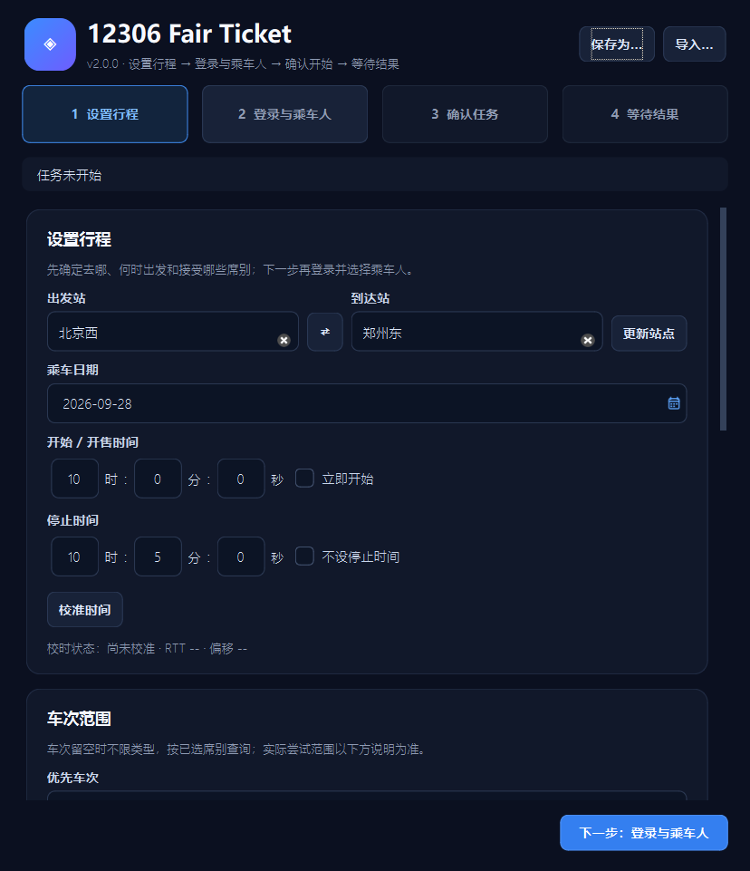

# 🚄 12306 Fair Ticket

一个用于正常购票的 Windows 桌面工具。填写行程并扫码登录后，它可以等待开售、查询余票，按你选择的车次和席别尝试提交订单。

**设置行程 → 登录并选择乘车人 → 确认并开始 → 等待结果**

**扫码登录不会开始抢票。只有在第三步点击“开始任务”，才会正式执行。**

## 下载与打开

1. [下载 Windows 便携版](https://github.com/Tuan-Space/12306FairTicket/releases/download/v2.0.0/12306FairTicket-2.0.0-Windows-x64.zip)，或打开 [下载页面](https://github.com/Tuan-Space/12306FairTicket/releases/latest)。
2. 完整解压 ZIP，然后双击 `12306FairTicket.exe`。
3. 请保留 EXE 旁边的整个 `_internal` 文件夹，不要只复制 EXE。

无需安装 Python。提交成功后，请到 **12306 App 或官网核对订单并支付**；软件不会代付，也不保证一定买到票。

## 四步使用

### ① 设置行程

填写出发站、到达站、乘车日期、开售时间和停止时间，再选择接受的席别。

- **车次**：可填一个或多个，例如 `G79，G81、D123`。不填则不限车次。
- **只尝试上述车次**：勾选后仅尝试填写的车次；不勾选时，其他符合条件的车次也可备选。
- **席别**：可同时选择坐席和卧铺，并拖动已选席别调整优先顺序。初次打开不会替你勾选。
- **尝试策略**：“车次优先”先按车次顺序尝试；“席别优先”先寻找最喜欢的席别。
- **任务模式**：选择自动提交订单，或仅监控余票。

多个车次或姓名可用中英文逗号、顿号、中英文分号、换行或制表符分隔。平时可保留高级参数的默认值。

完成后点击 **“下一步：登录与乘车人”**。

### ② 登录并选择乘车人

在账号区域点击蓝色的 **“扫码登录 12306”**，使用手机 12306 App 扫码并确认。

登录成功后，直接勾选本次乘车人，最多 5 人；也可以手动填写姓名。姓名须与当前账号中的乘车人一致。若联系人没有读取成功，可重新读取或手动填写，已经完成的登录会保留。

每个人都可以选择本次购买的车票类型：

- **默认**：按 12306 中的乘客信息购买，界面会显示已读取的成人／学生类型。
- **成人票**：学生联系人也可以为本次行程购买成人票。
- **学生票**：需要联系人具备学生身份，并通过 12306 的资格审核。

选好后点击 **“下一步：确认任务”**。此时还没有开始查票。

### ③ 确认并开始

核对行程、乘车人、车次、席别顺序和时间。需要修改时，可以返回上一步。

本页还可以设置购票偏好：

- **座位**：选择靠窗、过道等位置。前排／后排表示两排相对位置，不代表行驶方向或具体车厢排号。
- **铺位**：选择下铺、中铺、上铺的数量。例如两人同行，可设置下铺 1、上铺 1。
- **静音车厢**：默认关闭，仅在二等座订单且服务端支持时尝试。同行人员需遵守静音要求。

座位或铺位偏好数量需要与乘车人数匹配。软件支持高级软卧、软卧、硬卧、一等卧和二等卧；接受哪些席别，就分别勾选哪些。能否选座、选铺及分配到静音车厢，以 12306 实际返回为准，偏好不保证满足。

确认后点击 **“开始任务”**，进入等待结果页面。

### ④ 等待结果

页面会显示当前正在准备、等待开售、查票、提交或等待订单结果。详细日志固定在下方，默认展开，可随时收起。

| 想做什么 | 如何操作 |
| --- | --- |
| 停止本次任务 | 点击“停止任务”，等待当前请求结束。 |
| 按原配置重新尝试 | 安全停止后点击原位置的“继续任务”，查询计数归零并开始新一轮，复用仍有效的登录状态。 |
| 修改配置 | 点击“上一步”，立即返回确认页并请求停止；收尾完成后即可修改，再点“开始任务”。 |
| 等待时登录失效 | 在结果页重新扫码，完成后自动继续当前任务，无需重新点开始。 |
| 已成功提交订单 | 点击“前往 12306 支付”，或在手机 App 的待支付订单中核对并支付。 |
| 订单结果不明确 | 先到 12306 核对订单。此时软件不会提供继续下单，避免重复提交。 |

**停止不会撤销服务器上的订单。** 原停止时间已过时，请修改时间后重新开始。

程序不会弹出 Windows 系统通知或播放提示音，请留意窗口中的状态和结果提示。

## 其他实用功能

- **保存与导入**：顶部“保存为…”可保存当前参数，也可保存未填完的草稿；下次通过“导入…”恢复。导入不会自动启动任务。
- **自动校时与登录复查**：定时任务通常会在开售前 3 分钟复查登录、前 1 分钟最终校时。建议提前几分钟完成准备并开始任务。
- **手动辅助操作**：“校准时间”位于时间设置及运行页；等待开售时，运行页可“检查登录状态”。这些操作不会新建抢票任务。
- **登录信息不落盘**：GUI 不保存 Cookie、二维码、Token、证件号码或手机号。每次重新打开程序需重新扫码，同次运行可复用有效会话。

## 界面预览

## 更多使用方式

需要更详细的操作说明，请看 [四步订票流程操作说明](docs/四步订票流程操作说明.md)。从源码运行、命令行使用及高级参数见 [GUI 与源码使用说明](README_GUI.md)。

第三方组件与许可证见 [THIRD_PARTY_NOTICES.md](THIRD_PARTY_NOTICES.md)。
