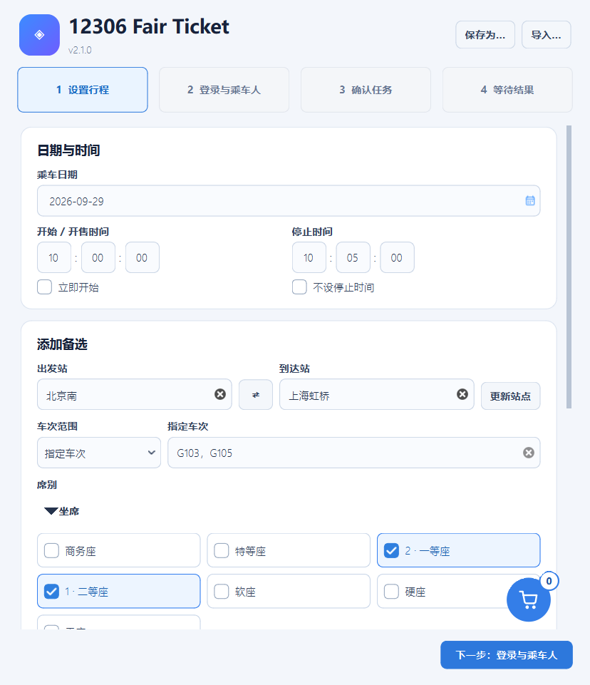
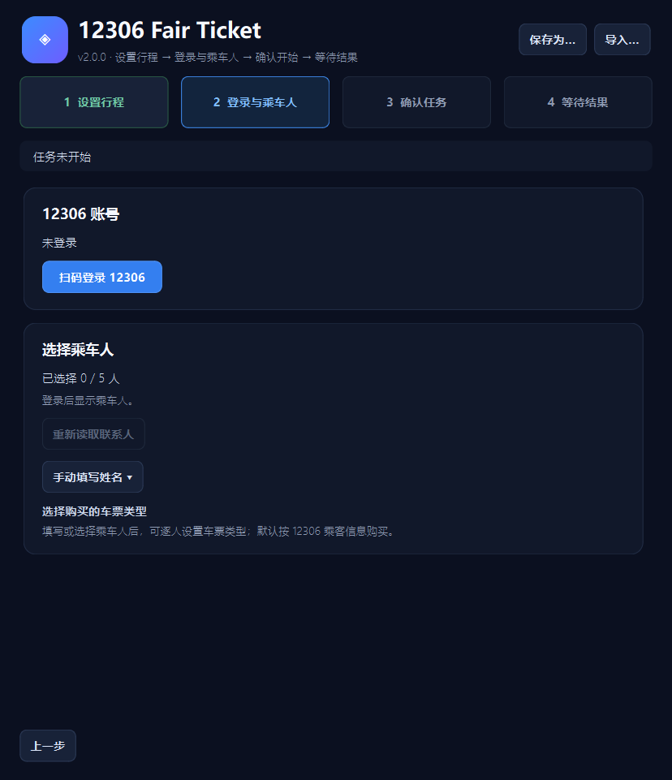
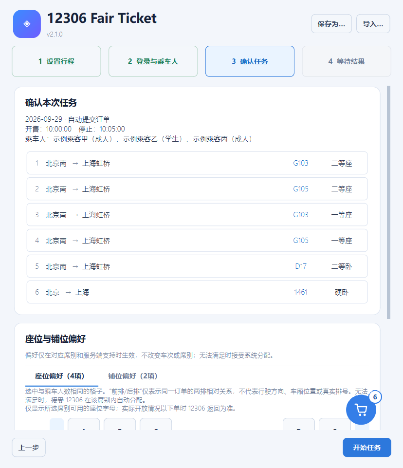
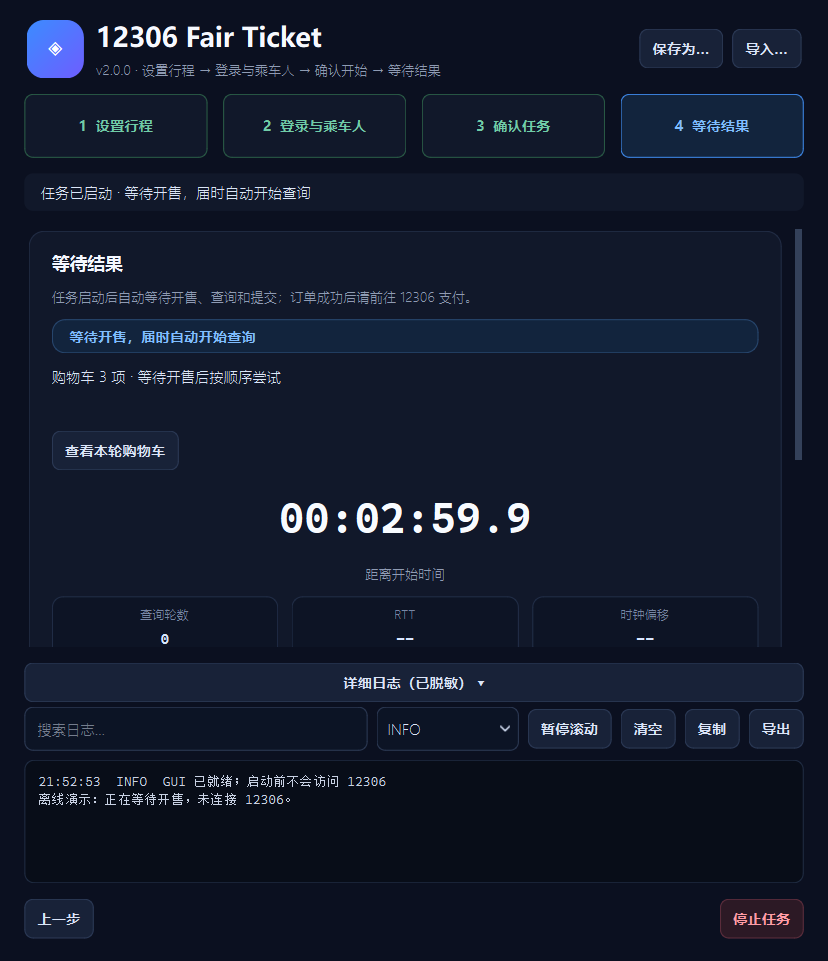

# 🚄 12306 Fair Ticket

### ⏱️ 自动校时 · ⚡ 提前就绪 · 🎯 开售即抢

**面向春运、节假日等热门时段的开源购票助手。**  
对齐 12306 服务器时间，把登录检查、校时和查询热身安排在开售前，发现余票后自动尝试提交。

**[📥 下载 Windows 版](https://github.com/Tuan-Space/12306FairTicket/releases/tag/v2.1.0)** · **[📖 使用说明](docs/四步订票流程操作说明.md)** · **[🛠️ 参与开发](https://github.com/Tuan-Space/12306FairTicket/blob/main/docs/开发指南.md)**

## 🚀 把准备做在开售前

| 核心能力 | 为开抢做好什么 |
| :--- | :--- |
| ⏱️ **服务器时间校准** | 多次采样，选取网络往返耗时最低的样本，补偿本机时差，校正任务计时。 |
| ⚡ **开售前自动准备** | 提前复查登录、再次校时并热身查询，减少开售时临时登录、手动刷新的操作。 |
| 🎯 **发现余票自动提交** | 按设定顺序尝试备选，任一订单成功后停止，随后前往 12306 支付。 |

🛒 **多站点购物车**：不同车站、车次、席别一起备选，拖动即可调整尝试顺序。  
👥 成人／学生票 · 💺 座位／铺位偏好 · 💾 配置保存 · 🌗 深浅主题

## 🧭 四步开抢

> **🗺️ 设置行程 → 📱 扫码选人 → 🚀 开始任务 → 🎫 等待结果**

| 步骤 | 你只需要做这些 |
| :--- | :--- |
| **① 🗺️ 设置行程** | 设好日期和开售时间，选择站点、车次与席别，点 **「加入购物车」**。 |
| **② 📱 扫码选人** | 点 **「扫码登录 12306」**，用手机确认登录，再选择乘车人和票种。 |
| **③ 🚀 开始任务** | 核对备选顺序和位置偏好，点 **「开始任务」**，程序开始准备并等待开售。 |
| **④ 🎫 等待结果** | 保持程序运行，查看查询与订单状态；**成功后到 12306 核对并支付**。 |

**第三步点击「开始任务」才会执行订票。** 需要修改时，可停止任务后返回调整。

## 🖼️ 看一眼，就会用

四张截图均来自 **2.1.0 实际程序**。

| ① 🗺️ 设置行程 | ② 📱 登录与乘车人 |
| :---: | :---: |
|  |  |
| **③ 🚀 确认并开始** | **④ 🎫 等待结果** |
|  |  |

## 📦 下载即用

**[⬇️ 下载 2.1.0 Windows 便携版](https://github.com/Tuan-Space/12306FairTicket/releases/tag/v2.1.0)**

下载 `12306FairTicket-2.1.0-windows-x64.zip` → **完整解压** → 双击 **`12306FairTicket.exe`**。

- 🪟 支持 **Windows 10/11 x64**，无需安装 Python。
- 📁 保留 EXE 旁的 **`_internal` 文件夹**，不要只复制 EXE。

## 📚 了解更多

📖 [详细操作说明](docs/四步订票流程操作说明.md) · ⚙️ [校时与抢票原理](https://github.com/Tuan-Space/12306FairTicket/blob/main/docs/抢票原理说明.md) · 🛠️ [源码运行与打包](https://github.com/Tuan-Space/12306FairTicket/blob/main/docs/开发指南.md) · 📄 [第三方许可证](docs/THIRD_PARTY_NOTICES.md)

💡 校时用于减少本机时间偏差，最大化降低网络和服务器处理延迟；购票结果仍取决于余票与 12306 服务。位置偏好以实际分配为准，软件不代付、不保证购票成功。

🔎 若显示「结果待核对」，请先到 12306 检查订单，避免重复购票。停止任务不会撤销已经生成的订单。

⭐ 如果这个项目对你有帮助，欢迎 **Star**，也欢迎通过 **[Issues](https://github.com/Tuan-Space/12306FairTicket/issues)** 反馈问题、通过 **[Pull Requests](https://github.com/Tuan-Space/12306FairTicket/pulls)** 一起改进。
