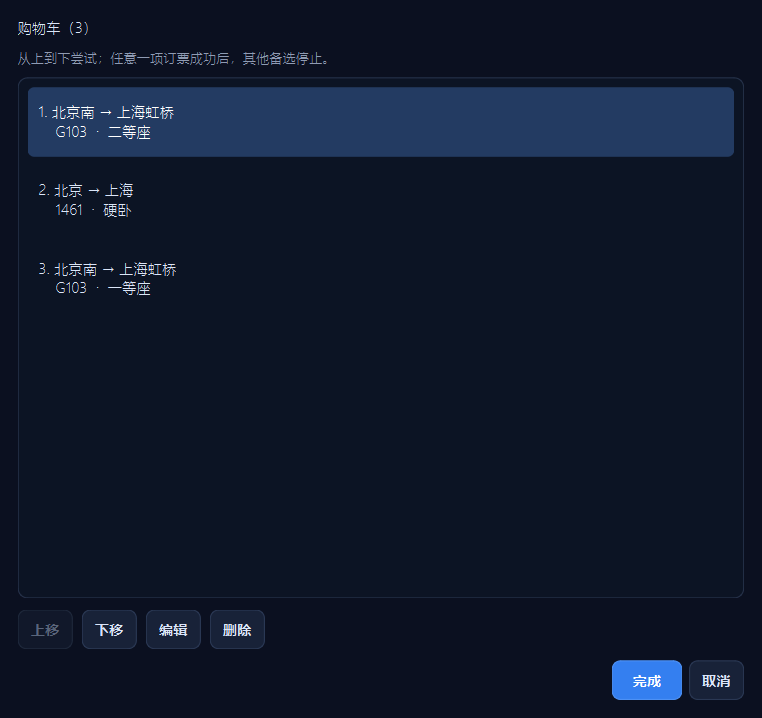

# 🚄 12306 Fair Ticket

一个带图形界面的 **12306 购票辅助工具**。把不同站点、车次、席别加入同一个购物车，扫码登录，确认后开始任务；它会等待开售，按购物车顺序尝试，任意一项成功便停止。

**🗺️ 设置行程 → 📱 登录并选择乘车人 → ✅ 确认并开始 → ⏳ 等待结果**

> 💡 **登录只是准备，第三步点击「开始任务」才会抢票。** 提交成功后，仍需到 12306 App 或官网核对并支付。

## 📦 下载与打开

1. 使用随本分支交付的 **购物车预览 ZIP**，或按 [开发指南](docs/开发指南.md) 从本分支源码运行、打包。已经发布的正式软件可在 [Releases](https://github.com/Tuan-Space/12306FairTicket/releases) 获取。
2. **完整解压** ZIP，双击 `12306FairTicket.exe`，无需安装 Python。
3. 保留 EXE 旁的 **`_internal` 文件夹**，不要只复制 EXE。

## 🚀 四步完成一次任务

### ① 🗺️ 设置行程

先设置公共的 **乘车日期、开售时间、停止时间**，再逐项添加备选：

**出发站 → 到达站 → 指定车次 / 不限车次 → 一种席别 →「加入购物车」**

- 🛒 **一行就是一个备选**：北京南 → 上海虹桥 · G103 · 二等座，与北京 → 上海 · 1461 · 硬卧，可以一起尝试。
- 💺 **同车不同席别分开加入**：G103 二等座和 G103 一等座各占一行，位置由你决定。
- 🚆 **多个车次一次填**：例如 `G103，G105、G107`，加入后会拆成 3 项。接受站对的所有车次时，请明确选择「不限车次」。
- ↕️ **点「购物车（N）」调整顺序**：拖动或点击上移 / 下移，也可编辑和删除。从上到下就是实际尝试顺序，不再另选车次优先或席别优先。
- 📝 **只使用已加入的项目**：没点「加入购物车」的输入不参与任务；离开第一步时会提醒处理未加入的更改。完全重复的项目不会重复添加。
- 🔍 **也可仅监控**：关闭自动提交后只查余票；高级参数通常保持默认。

> 🎯 **这是一趟出行的多个备选，不是分别购买多段行程。** 所有项目共用日期与乘车人，任意一项成功，全车停止。站对越多，一轮查询可能越久。

购物车至少有一项后，点击 **「下一步：登录与乘车人」**。

### ② 📱 登录并选择乘车人

点击账号区域的蓝色 **「扫码登录 12306」**，用手机 **12306 App** 扫码并确认。登录成功后，直接勾选乘车人，最多 5 人，再点 **「下一步：确认任务」**。

- 👥 每人可选 **默认（按 12306 乘客信息）／成人票／学生票**；学生联系人也可买成人票，学生票仍需通过 12306 资格审核。
- ✍️ 可以手动填写姓名，须与账号联系人一致。姓名或车次支持 `, ， 、 ; ；`、换行和制表符分隔。
- 🔄 联系人读取失败时，已登录状态会保留，可以重新读取或手动填写。

**这一步不会查票，也不会下单。**

### ③ ✅ 确认并开始

按顺序核对 **购物车中的站对、车次和席别，以及公共乘车人和时间**，需要时设置位置偏好，最后点击 **「开始任务」**。

| 偏好 | 怎么设置 |
| --- | --- |
| 💺 座位 | 选靠窗、过道或相对前后排；「前排／后排」不是行驶方向或具体排号。 |
| 🛏️ 铺位 | 填上、中、下铺数量，例如两人选「下铺 1、上铺 1」。支持高级软卧、软卧、硬卧、一等卧、二等卧。 |
| 🤫 静音车厢 | 默认关闭；二等座且 12306 支持时尝试，全部同行人须遵守静音要求。 |

偏好统一设置，只对购物车中适用的项目生效；删除对应席别后会保留为未启用设置。启用的座位／铺位数量需与乘车人数一致。**位置和静音都是偏好，不保证满足**；实际能力以 12306 返回为准，程序不会为了换位置取消重订。

### ④ ⏳ 等待结果

保持程序运行，查看 **等待开售 → 查票 → 提交 → 订单结果**，以及当前项目的序号、实际站对、车次和席别。成功后会明确显示买到了哪一段。详细日志固定在下方，可以收起。

| 你想做什么 | 点击哪里 |
| --- | --- |
| ⏹️ 暂停这轮尝试 | 「停止任务」，等待当前请求结束。 |
| ▶️ 按原购物车再试 | 安全停止后点「继续任务」，使用原任务快照重新开始，查询轮数归零，复用仍有效的登录。 |
| ↩️ 修改配置 | 「上一步」会返回确认页并取消本轮；停止完成后修改，再点「开始任务」。 |
| 📱 等待中登录失效 | 在结果页重新扫码，成功后自动继续，无需再点开始。 |
| 🎉 订单提交成功 | 「前往 12306 支付」，或打开 App 的待支付订单核对并支付。 |

**停止不会撤销服务器上的订单。** 如果提示订单结果不明确，请先去 12306 核对；程序会阻止直接重复下单。原停止时间已经过去时，需要先修改时间。

## 🖼️ 新版四步界面

以下直接截取自 **购物车分支的实际界面**。乘车人和等待状态使用离线演示数据；没有真实登录或下单。点击图片可查看大图。

| ① 🗺️ 设置行程 | ② 📱 登录入口 |
| :---: | :---: |
|  |  |
| **③ ✅ 确认任务** | **④ ⏳ 等待结果** |
|  |  |

### 🛒 购物车与实际尝试顺序

## ✨ 还有这些实用功能

- ⏱️ **自动校时**：对齐服务器时间，按设置提前热身；定时任务通常在开售前 3 分钟复查登录、前 1 分钟最终校时。
- 💾 **保存与导入**：顶部「保存为…」可保存购物车与公共参数，下次导入恢复（添加区未加入的内容不保存）；导入不会自动开始任务。
- 🔐 **登录信息不落盘**：GUI 不保存 Cookie、二维码、Token、证件号码或手机号；保存配置会包含你填写的姓名和行程。
- 🔄 **会话复用**：同次打开程序可复用有效登录；退出重开需重新扫码。
- 🔇 **安静运行**：不弹 Windows 系统通知、不播放提示音，结果和异常显示在程序窗口。
- 🌗 **深浅主题**：跟随系统显示，步骤条和主要操作始终可见。

## 📚 更多帮助

- 📖 [详细操作说明](docs/四步订票流程操作说明.md)
- 🧰 [从 GitHub 下载源码、运行与打包](docs/开发指南.md)
- ⚙️ [程序运行原理](docs/抢票原理说明.md)
- 📄 [第三方组件与许可证](docs/THIRD_PARTY_NOTICES.md)

请用于本人正常购票。能否买到票取决于余票、网络及 12306 服务；软件不代付，也不保证抢票成功。
